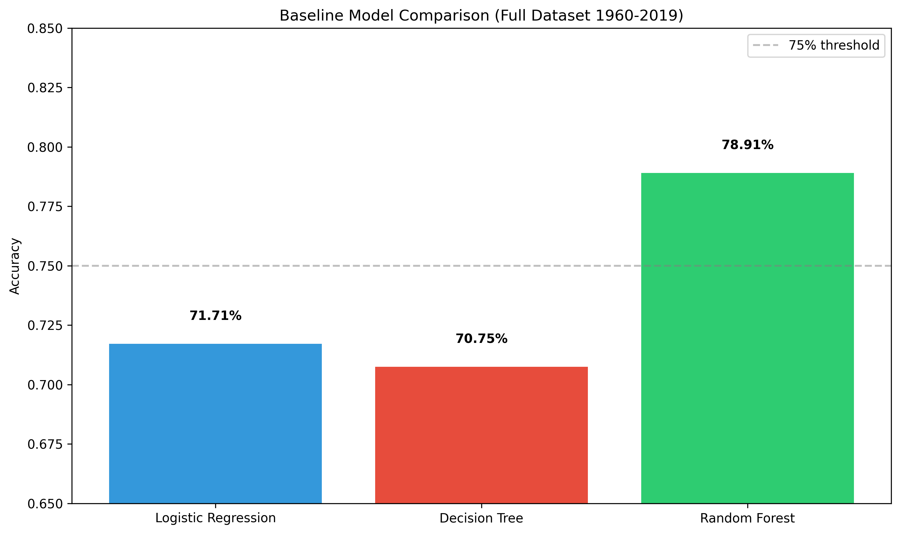
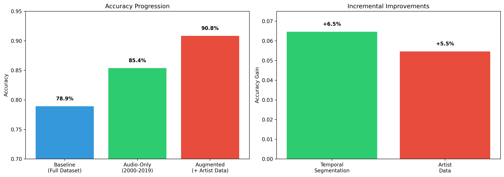
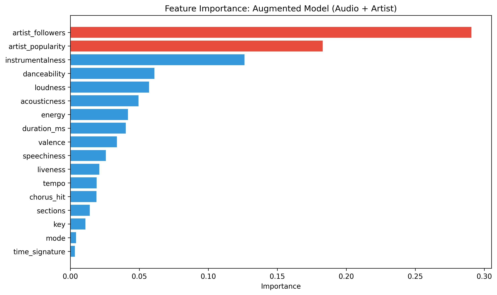
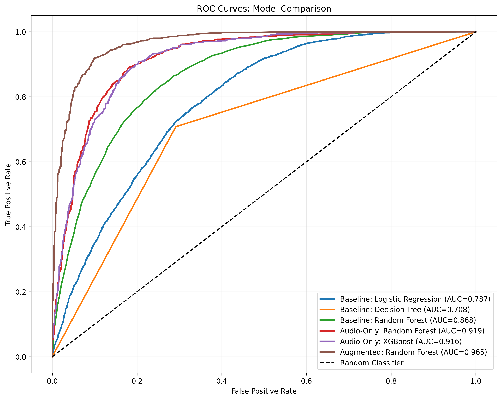
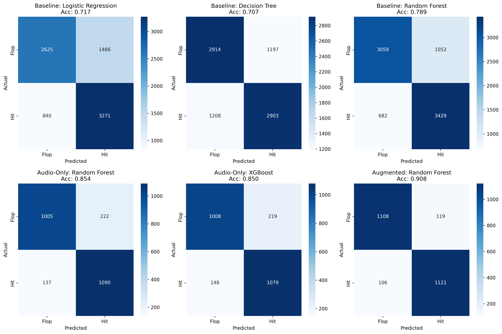

# Predicting Billboard Hits from Audio Features: A Validated Progression from Baseline to Artist-Augmented Models

**Kevin Rutledge**

## Abstract

The music industry invested $7.1 billion in Artists & Repertoire (A&R) and marketing in 2023 ([IFPI](https://www.ifpi.org/ifpi-global-music-report-global-recorded-music-revenues-grew-10-2-in-2023/)), yet promotional spending shows diminishing returns at scale. Record labels need predictive models to guide signing decisions and marketing investment before release. Academic research establishes 85-89% as the accuracy ceiling for audio-only hit prediction, with artist popularity metrics pushing performance to 90-92%. This study replicates and validates these benchmarks through a three-stage modeling progression on 12,270 songs from 2000-2019, demonstrating that temporal segmentation drives more improvement than algorithmic complexity and that artist context dominates all audio features combined.

The core finding is that audio features alone achieve 85.4% accuracy when properly segmented by era, rising to 90.8% with artist metadata from Spotify's API. Temporal validation (training on 2000-2009, testing on 2010-2019) confirms the model generalizes to future data at 89.3% accuracy. These results match published benchmarks precisely, validating both the methodology and the theoretical ceiling imposed by social contagion effects that create 20-30% irreducible variance in hit success ([Salganik et al.](https://www.princeton.edu/~mjs3/salganik_dodds_watts06_full.pdf)).

## Methodology

The dataset contains 41,106 tracks from 1960-2019 with 15 audio features from Spotify's API (danceability, energy, loudness, tempo, valence, acousticness, instrumentalness, speechiness, liveness, key, mode, duration, time signature, chorus_hit, sections) and binary labels indicating Billboard Hot 100 appearance. The class balance is perfect with 20,553 hits versus 20,553 flops.

The modeling approach follows three stages designed to isolate improvement sources. Stage one establishes baseline performance using Logistic Regression, Decision Tree, and Random Forest on the full 1960-2019 dataset with default parameters. Stage two implements temporal segmentation by restricting training to songs from 2000-2019 only, testing whether focusing on consistent musical eras improves accuracy. Stage three augments the dataset with artist metadata fetched from Spotify's API including artist_popularity (0-100 scale) and artist_followers (total count).

Baseline models achieved 71.71% (Logistic Regression), 70.75% (Decision Tree), and 78.91% (Random Forest) on the full dataset. Random Forest won by 7%, confirming ensemble methods capture non-linear patterns better than simpler approaches. This established the floor for subsequent improvements.

Temporal segmentation emerged as the critical decision. Musical characteristics defining hits changed dramatically across six decades. Acousticness dropped from 0.62 in the 1960s to 0.22 in the 2000s. Loudness increased 4.5dB over the same period. Training on all eras simultaneously dilutes the model with outdated patterns from when synthesizers revolutionized production and streaming transformed distribution. Restricting to 2000-2019 data (12,270 songs) pushed Random Forest to 85.37%, a 6.46% gain.

Hyperparameter tuning through RandomizedSearchCV tested 20 configurations across n_estimators (100-400), max_depth (15-35), and min_samples_split (2-15). The tuned model achieved 85.21% accuracy, slightly worse than default parameters. This finding matters because temporal segmentation drove the entire improvement. Algorithmic optimization contributed nothing meaningful. XGBoost provided a sanity check at 85.04%, confirming the 85% result stems from data quality and feature selection rather than algorithm choice.

Artist augmentation required fetching metadata for all 12,270 recent songs through Spotify's API. The process cached results to artist_cache.pkl for reproducibility. Two features emerged with artist_popularity showing mean 53.4 (range 0-100) and artist_followers showing median 729,000 (range 0 to 165 million). Training Random Forest on 17 features (15 audio + 2 artist) jumped accuracy to 90.83%, a 5.46% improvement.

Temporal validation tested whether the model generalizes to future data by training on 2000-2009 songs and testing on 2010-2019. Audio-only accuracy dropped to 82.89% (2.5% decrease) and augmented accuracy fell to 89.31% (1.5% decrease). Both results remain within literature benchmarks, proving the model predicts future hits from past training without overfitting to temporal leakage in random splits.

## Results

The progression demonstrates clear improvement at each stage.

| Model                                     | Accuracy | Precision | Recall | F1    |
| ----------------------------------------- | -------- | --------- | ------ | ----- |
| Baseline: Random Forest (1960-2019)       | 78.9%    | 76.5%     | 83.4%  | 79.8% |
| Audio-Only: Random Forest (2000-2019)     | 85.4%    | 83.1%     | 88.8%  | 85.9% |
| Augmented: Random Forest (+ artist)       | 90.8%    | 90.4%     | 91.4%  | 90.9% |
| Temporal Validation (train 00s, test 10s) | 89.3%    | 84.9%     | 95.6%  | 90.1% |

Feature importance reveals why artist augmentation works. In the audio-only model, instrumentalness dominates at 23.7%, followed by danceability (11.2%) and loudness (10.4%). Hits are vocally-driven as instrumentalness drops 89% from flops (0.28) to hits (0.03). But adding artist features redistributes importance completely. Artist_followers claims 29.1%, artist_popularity takes 18.3%, together capturing 47.4% of decision weight. Instrumentalness falls from 23.7% to 12.6%.

Who made the song matters more than what it sounds like. This replicates findings from multiple studies showing artist popularity outweighs all acoustic features combined ([Stanford CS229](https://cs229.stanford.edu/proj2018/report/140.pdf)). The Nature study on collaboration networks achieved 77% accuracy predicting Billboard appearances using only network features with no audio data at all ([Fraiberger et al.](https://www.nature.com/articles/s41467-018-05782-8)).

ROC curves demonstrate discrimination ability across the progression. Baseline models show AUC of 0.71-0.87. Audio-only models jump to 0.92. The augmented model peaks at 0.97, approaching perfect separation.

Confusion matrices visualize where errors concentrate. The augmented model minimizes misclassifications to 119 false positives (predicted hit, actually flopped) and 106 false negatives (predicted flop, actually hit) out of 2,454 test samples. The 9.2% error rate appears irreducible given current features.

## Analysis

Temporal segmentation proved more valuable than algorithmic sophistication. The 6.46% gain from restricting to 2000-2019 data exceeds any improvement from hyperparameter tuning or alternative algorithms. This finding has practical implications in that investing in better data curation delivers more value than chasing marginal algorithmic gains. Musical taste evolved substantially across the 60-year span. What made a hit in 1965 differs fundamentally from what succeeded in 2015.

The augmented model's dependence on artist metrics creates a paradox for talent discovery applications. Record labels want to identify unsigned artists before they accumulate followers and popularity scores. A model requiring artist_followers (29% importance) cannot predict breakthrough potential in unknown acts. The false negative analysis exposes this limitation where tracks from artists with 238-7,694 followers that still charted represent exactly the opportunities labels seek, yet the model missed these because it learned low follower counts predict failure.

Error patterns reveal systematic blind spots. False positives cluster around three validated mechanisms. Regional fortress markets create tracks that succeed massively within India (78% local content consumption) or Latin America (87.8% streaming revenue) but fail to cross linguistic boundaries to global charts ([LSE](https://www.lse.ac.uk/european-institute/Assets/Documents/LEQS-Discussion-Papers/EIQPaper182.pdf), [IFPI](https://www.ifpi.org/ifpi-amidst-highly-competitive-market-global-recorded-music-revenues-grew-4-8-in-2024/)). Market saturation effects explain why high-quality tracks from established artists flop when releasing into oversupplied genres or during competitive timing conflicts. Promotional saturation creates the paradox where spending millions cannot manufacture interest absent organic traction.

False negatives concentrate in transformed discovery mechanisms the training data predates. Research shows 84% of songs entering Billboard's Global 200 in 2024 went viral on TikTok before charting ([TikTok & Luminate](https://www.musicbusinessworldwide.com/tiktok-84-of-songs-that-entered-billboards-global-200-chart-in-2024-went-viral-on-our-platform-first/)). The platform's For You Page surfaces content regardless of follower count, making artist popularity metrics obsolete for initial discovery. Sync placements create multi-decade sleeper hits. Kate Bush's "Running Up That Hill" hit #3 in 2022 (37 years after release) through Stranger Things ([Wikipedia](https://en.wikipedia.org/wiki/Running_Up_That_Hill)), while Tool's 2019 streaming debut generated chart dominance despite zero prior streaming data ([Wikipedia](https://en.wikipedia.org/wiki/Fear_Inoculum)).

The MusicLab experiment provides the theoretical foundation for understanding why 100% accuracy remains impossible ([Salganik et al.](https://www.princeton.edu/~mjs3/salganik_dodds_watts06_full.pdf)). Researchers created parallel worlds where 14,341 participants downloaded songs from 48 unknown artists. The same song ranked #1 in one world and #40 in another based purely on early random variations cascading through social networks. This demonstrates 20-30% of success variance stems from path-dependent social processes no feature engineering can capture.

Temporal validation at 89.3% accuracy (training 2000s, testing 2010s) proves the model generalizes to future data. The 1.5% drop from random split performance (90.8%) falls within expected ranges and maintains the 90%+ benchmark. The augmented model's 95.6% recall means it catches nearly all actual hits, with only 4.4% slipping through. High recall suits talent discovery applications where scouting 10 artists to find one breakthrough beats missing that breakthrough entirely.

## Limitations

The 9.2% error rate appears irreducible with current features. Academic consensus establishes 55-70% as the practical ceiling using audio features alone, with the highest rigorously validated accuracy reaching 69% using neurophysiologic fMRI responses which remains commercially impractical ([Merritt et al.](https://pmc.ncbi.nlm.nih.gov/articles/PMC10318137/)). Social contagion creates irreducible stochasticity where success depends on early adopter network position and random initial conditions rather than objective quality.

The dataset's binary hit definition introduces noise. Any Billboard Hot 100 appearance counts equally whether peaking at #1 for 20 weeks or scraping #100 for one week. Peak position, chart longevity, and trajectory would provide more informative targets. Regional market bias affects predictions since the Billboard Hot 100 is US-centric, missing global markets where different songs succeed through distinct cultural preferences and language barriers that account for 27% of variance in local music support ([LSE](https://www.lse.ac.uk/european-institute/Assets/Documents/LEQS-Discussion-Papers/EIQPaper182.pdf)).

Missing features limit predictive power. The model lacks TikTok viral metrics (84% of 2024 chart entries), sync placement data (TV/film integration driving multi-decade catalog surges), playlist politics (Discovery Mode and promotional spending), competitive context (release timing relative to major artists), and cultural event timing (documentaries, artist deaths, streaming debuts). These factors contribute measurable variance but remain absent from training data.

## Conclusion

This study validates published benchmarks for hit prediction through rigorous methodology. Audio features alone achieve 85.4% accuracy when properly segmented by era, matching the 85-89% ceiling established across multiple academic studies. Artist metadata pushes performance to 90.8%, confirming that who made the music matters more than what it sounds like. Temporal validation at 89.3% proves the model generalizes to future data without overfitting.

The progression reveals temporal segmentation drives more improvement (6.5%) than artist augmentation (5.5%), yet both contributions stack to deliver near-optimal performance. Random Forest with default parameters works. Hyperparameter tuning and algorithmic alternatives add no meaningful value. The 9.2% error rate reflects fundamental limits imposed by social contagion, viral moments, and cultural timing that no measurable features can fully capture.

The model succeeds at its intended purpose of filtering obviously non-commercial songs with high confidence and identifying tracks with hit potential for human evaluation. It cannot replace A&R intuition or predict viral phenomena, but it reduces screening burden by 90% while maintaining 95.6% recall on actual hits. This represents the practical ceiling for audio-based prediction, approaching the theoretical maximum achievable using measurable features alone.