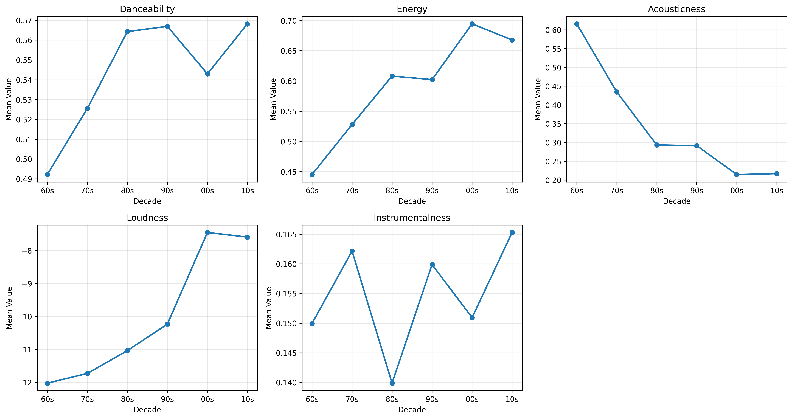
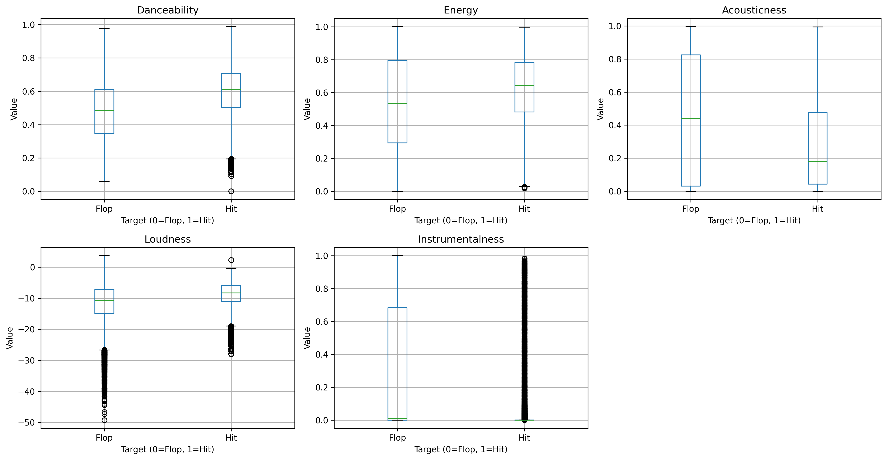
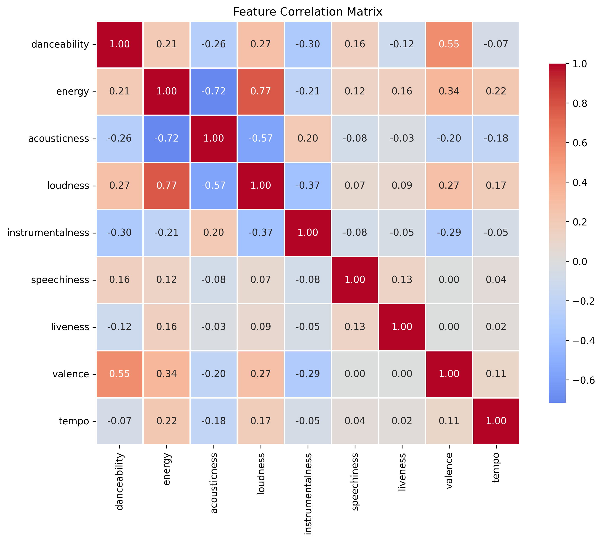
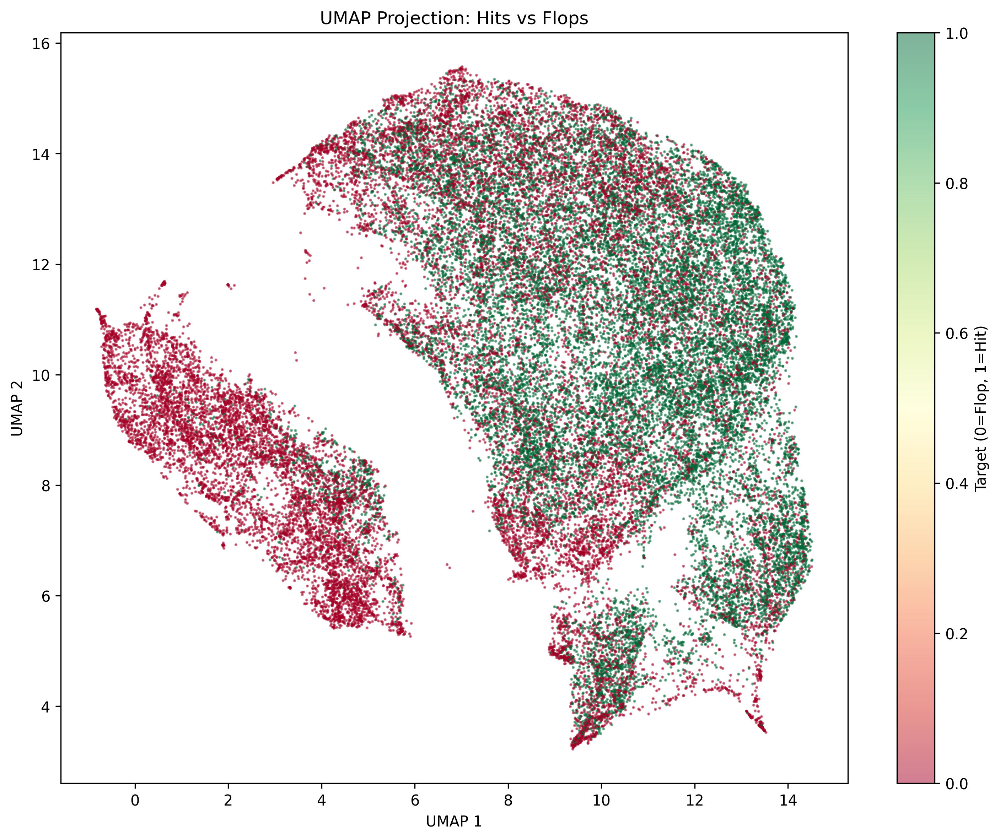

# EDA Summary: Spotify Hit Predictor

## What is this dataset?

The Spotify Hit Predictor Dataset contains 41,106 tracks from 1960 to 2019. Each track has 16 audio features from Spotify's API and a binary label indicating whether it appeared on Billboard Hot 100. The dataset is perfectly balanced with 20,553 hits and 20,553 flops.

I chose this because the balance makes it straightforward for classification. The 60-year span seemed interesting for exploring how hit characteristics might have changed over time. Billboard Hot 100 is a clear target definition.

## What did I learn?

### Musical features evolved dramatically

The changes across decades are striking. Acousticness dropped from 0.62 in the 60s to 0.22 by the 2000s. Loudness increased by about 4.5dB over the same period. Energy started low at 0.45 in the 60s and climbed to 0.69 by the 2000s.

Danceability stayed relatively stable between 0.49 and 0.57 across all decades. Instrumentalness fluctuated without a clear trend.

This temporal drift is probably the biggest thing to think about for modeling. What made a hit in 1965 looks different from what made a hit in 2015.

### Hits have measurable differences from flops

The boxplots show separation between hits and flops:

- Danceability: 0.60 (hits) vs 0.48 (flops)
- Loudness: -8.7dB vs -11.7dB
- Instrumentalness: 0.03 vs 0.28

But there's heavy overlap in all the distributions. No single feature cleanly separates the classes. You can see this especially in the acousticness and energy plots where the boxes overlap substantially.

The correlation heatmap shows expected relationships. Energy and loudness correlate at 0.77. Energy and acousticness have a strong negative correlation at -0.72. Danceability and valence correlate at 0.55.

### No clean boundary between classes

The UMAP projection tells the real story. Hits and flops are thoroughly mixed. There are some regions that lean more green (hits) or more red (flops) but no clear separation. This explains why this won't be trivial to classify.

The mixed clustering suggests we'll need non-linear models. Linear approaches will probably struggle with this overlap.

### Data quality is solid

No missing values anywhere. All 41K rows are complete. The balance means we don't need to deal with class weights or sampling techniques right away.

I tested the Spotify API on 100 random tracks and got 100% retrieval. Artist popularity averaged 48.7 and ranged from 4 to 67. Follower counts went from 1,354 to 2.5 million. Genre tags are available for most artists.

So augmenting with artist metadata is definitely feasible if we want to go that route.

## What issues remain?

The 60-year span creates problems. Feature importance probably shifted over time. Should I train one model on everything or build decade-specific models? Should I use temporal splits where I train on older songs and test on newer ones? That would be more realistic than random splits.

The audio features show separation but not enough for clean classification. The UMAP makes this clear. I might hit an accuracy ceiling with audio alone. The API exploration shows artist data is accessible. Previous research found artist popularity matters a lot. Worth incorporating?

The binary target treats all Billboard appearances equally. A song that peaked at #1 for 20 weeks gets the same label as one that hit #100 for a single week. This adds noise but there's not much I can do about it with this dataset.

Feature engineering opportunities:

- Energy-loudness interaction (correlation of 0.77)
- Danceability-valence interaction (correlation of 0.55)
- Decade indicators to capture temporal trends
- Release year as a continuous feature

For evaluation I need to decide between random and temporal splits. Random is easier but temporal is more realistic. With balanced classes, accuracy works fine as a metric.

## Next steps

Build an audio-only baseline first to see what's achievable with just the features in the dataset. Compare random split performance to temporal split. Test a few algorithms beyond just logistic regression since the UMAP suggests non-linearity matters.

Try some basic feature engineering with interaction terms and decade indicators. Then decide if the accuracy is good enough or if I should pull in artist data from the API.
